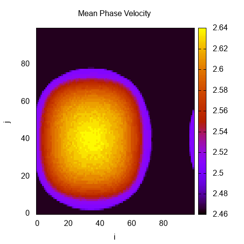
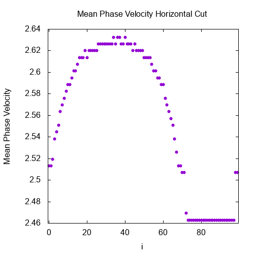

# Chimera patterns in 2D networks of coupled FitzHugh-Nagumo neurons

In this project we recreated part of the results of the paper __Chimera patterns in two-dimensional networks of coupled neurons__ in __docs__ folder. We created a simulation of a network of FitzHugh-Nagumo oscillators coupled in a two-dimensional toroidal geometry in order to observe the *Chimera States* that arise. For the simulation algorithm we used *Euler* method and *Runge-Kutta* method with two and four stages. In order to accelarate the simulation we used *OpenMP* API. Part of the simulations was executed in *ARIS* supercomputer.

> Equations (2a) and (2b) of the paper __Chimera patterns in two-dimensional networks of coupled neurons__ were printed incorrectly. The term with the summation must be subtracted from the rest of the equation.

The simulation program gets as command line arguments the name of the output folder and a set of simulation parameters (grid size, coupling radius, coupling phase, simulation time and seed for the random initial conditions generator). The simulation creates a *.dat* file every 20 time units that contains the potential value of each neuron in the grid. It also creates a *.dat* file for the mean phase velocity of each neuron in the grid, a *.dat* file for the mean phase velocity horizontal cut (the cut is made for j = 50) and a *.dat* file with the total simulation time. After the simulation is finished a python script creates *.png* files for each potential *.dat* file, for the mean phase velocity *.dat* file and the mean phase velocity horizontal cut *.dat* file. Finally, a *.gif* file is created to demonstrate the potential evolution through time.

## Getting Started

These instructions will get you a copy of the project on your local machine.

### Prerequisites

* C++ compiler
* Python 3
    - [PIL package](https://pypi.org/project/Pillow/)
* Gnuplot

### Simulation Setup/Run

After downloading the software in the *Prerequisites* section you can clone this repository on your local machine.

Before you start create a folder with the name __resources__. This will be the folder in which the output folders will be created.

*Compile simulation file*

```cpp
g++ -Wall -O3 -fopenmp -o .\FHN_sim_RK2.exe .\FHN_sim_RK2.cpp
```

*Run simulation*

```cpp
.\FHN_sim_RK2.exe simulation_N_100_R_33 100 33 1.370796 2000 15885 
```

*Run python plotting script*

```
python .\out_plotting_script.py resources simulation_N_100_R_33
```

## Sample Output

Here we demonstrate the output *.png* and *.gif* files for the parameters in* Run simulation* section.

* *Initial conditions (random)*


* *Potential for each neuron in the grid after 2000 time units*


* *Mean phase velocity for each neuron in the grid at the end of the simulation*


* *Mean phase velocity horizontal cut at the end of the simulation*


* *Potential GIF*


## Author

* **Ferikoglou Aggelos**

This project was created through my *Internship* in *National Centre of Scientific Research "Demokritos"* supervised by *Dr. Astero Provata*.
